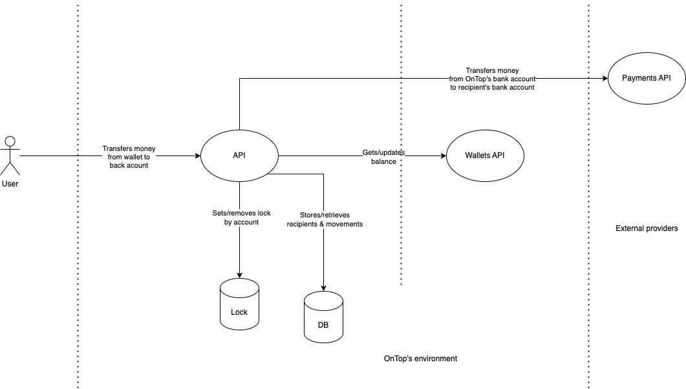

# OnTop Home Challenge

Hi there! This is my implementation for the proposed home challenge. [Read the
requirements here](./docs/requirements.pdf).

## How to run it

```bash
# Locally
$ ./gradlew bootRun

# With Docker Compose
$ docker-compose up  # use -d to detach
```

## Diagrams

### Archicture



### Sequence


### Models


## Examples

### Successful transfer


### Reverted transfer by Payment Provider error


### Failed by Wallet API error


