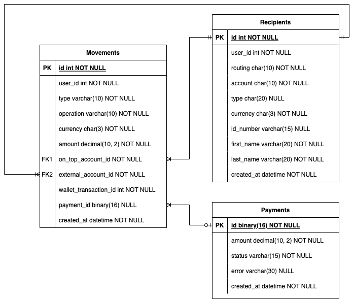
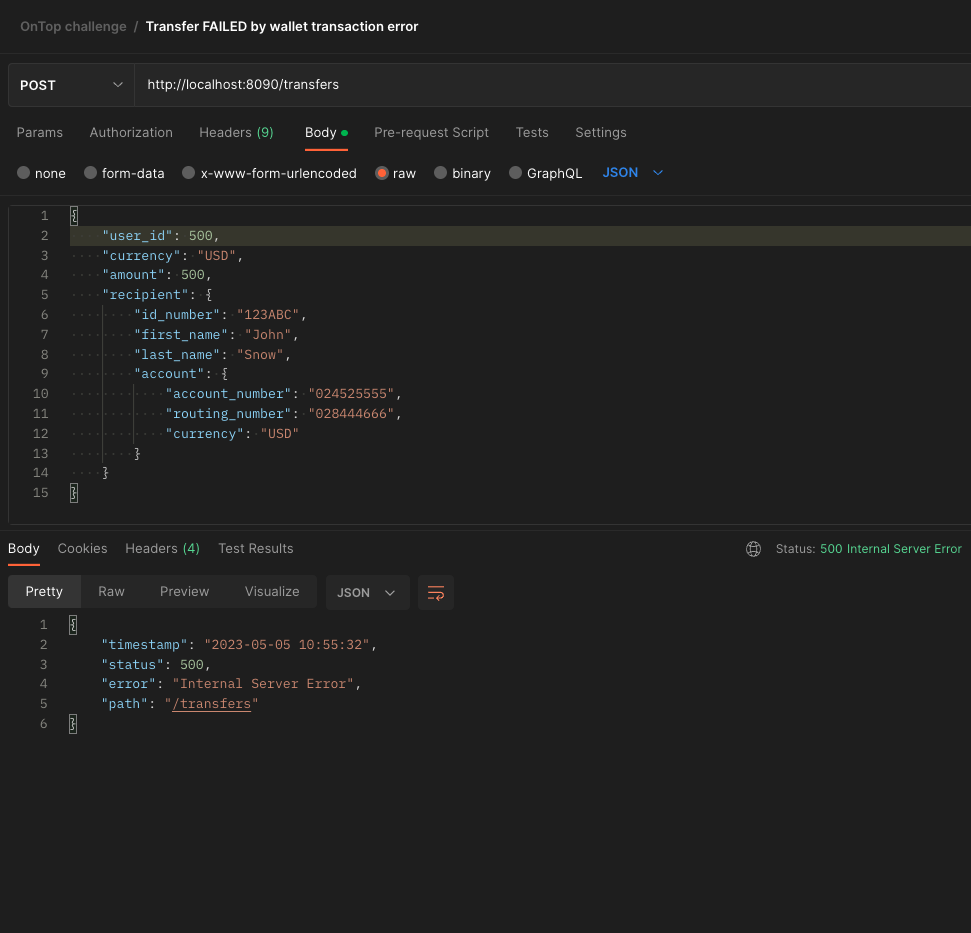

 

# OnTop Home Challenge

Hi there! This is my implementation for the proposed home challenge. [Read the
requirements here](./docs/requirements.pdf).

## How to run it

```bash
# Locally
$ ./gradlew bootRun

# With Docker Compose
$ docker-compose up  # use -d to detach
```

Once up and running you can use the `postman_collection.json` to import use case
examples.

### Required environment variables

```bash
# Change as required
ONTOP_ROUTING=028444018
ONTOP_ACCOUNT=0245253419
ONTOP_NAME=ONTOP INC

TRANSACTIONS_FEE_PERCENT=0.1

PAYMENT_PROVIDER_HOST=http://mockoon.tools.getontop.com:3000

WALLET_HOST=http://mockoon.tools.getontop.com:3000

SERVER_PORT=8090

REDIS_HOST=redis
REDIS_PORT=6379

DATABASE_HOST=db
DATABASE_PORT=3306
DATABASE_NAME=ontop
DATABASE_USERNAME=ontop
DATABASE_PASSWORD=ariel17
```

## Diagrams

### Archicture


### Sequence


### Models



## Examples

### Successful transfer


### Reverted transfer by Payment Provider error


### Failed by Wallet API error


