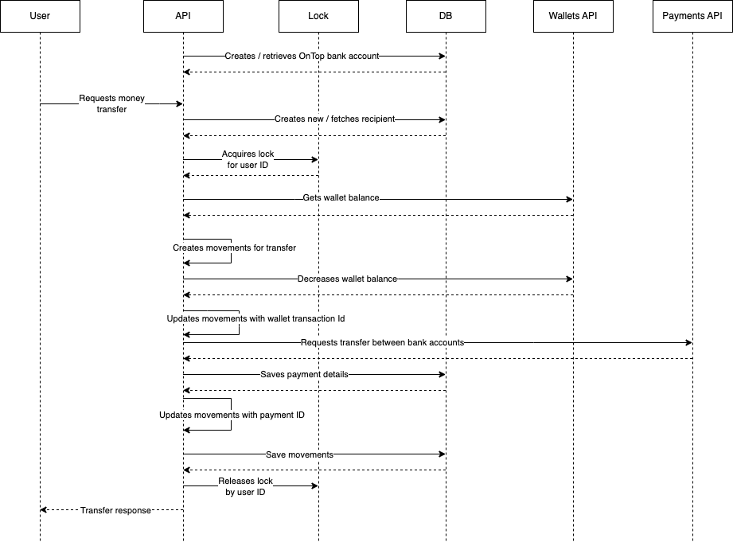

# OnTop Home Challenge

Hi there! This is my implementation for the proposed home challenge. [Read the
requirements here](./docs/requirements.pdf).

## How to run it

### Locally

TODO

### With Compose
TODO

You can also build and run the application with Docker Compose as follows:

```bash
# terminal 1
$ docker-compose up  # use -d to detach and use a single terminal

# terminal 2
$ curl -X POST "http://localhost:8080/transfers" --data '{"user_id"}' | jq .
```

## Diagrams

### Archicture


### Sequence



### Models


